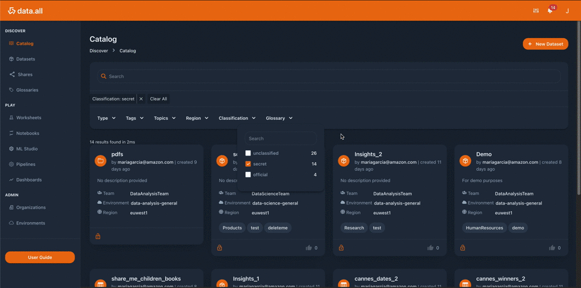

# AWS data.all

An open source development framework to help you build a data marketplace on AWS.
**data.all** builds a modern data workspace that makes collaboration
among diverse users (like business, analysts and engineers) easier, 
increasing efficiency and agility in data projects ✨

## Motivation

Data teams can be diverse: analysts, scientists, engineers, business users. Diverse people, with 
diverse tools and skillsets — diverse "DNAs". All leading to chaos and resulting in titanic 
efforts spent in Collaboration Overhead.

Using data.all, any line of business within an organization can create their own isolated data lake, 
produce, consume and share data within and across business units, worldwide. By simplifying data discovery, 
data access management while letting more builders use AWS vast portfolio of data and analytics services, 
data.all helps more data teams discover relevant data and let them use the power of the AWS cloud 
to create data driven applications faster.

## Getting started

Visit our [GitHub pages](https://awslabs.github.io/aws-dataall/) 
to get started and learn more about the architecture and the code of **data.all**
- Deployment guide
- Architecture
- Code Walkthrough

## Getting Help

The best way to interact with our team is through GitHub.  You can open an issue and choose from one of our templates 
for bug reports, feature requests, or documentation issues.  If you have a feature request, don't forget you can 
search existing issues and upvote or comment on existing issues before creating a new one.

## Contributing

Whether it's a bug report, new feature, correction, or additional
documentation, any feedback or contribution is greatly welcomed.
Please see [CONTRIBUTING.md](./CONTRIBUTING.md) for details 
on how to set up a development
environment and submit code.

## Other Ways to Support

One way you can support our project is by increasing its visibility and let others know that your organization 
deployed data.all.  If you would like 
us to include your company's name and/or logo in this README file, please raise a 'Support AWS data.all' issue.  
Note that 
by raising this issue (and related pull request), you are granting AWS permission to use your company’s name 
(and logo) for the limited purpose described here. Consequently, you are confirming that you have authority to grant such 
permission.

## License
This project is licensed under the Apache-2.0 License.
See the [LICENSE](https://github.com/awslabs/aws-dataall/blob/master/LICENSE) file for our project's licensing.

