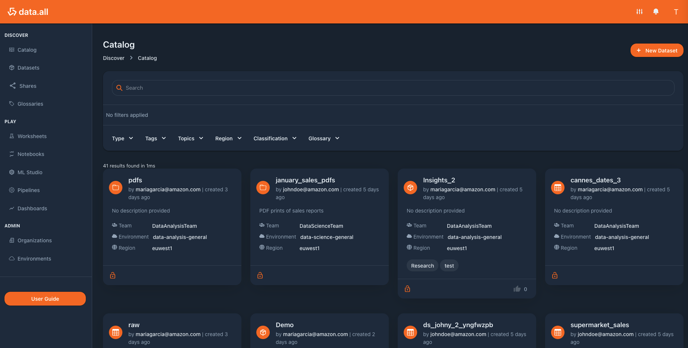

# **What's data.all**

An open source development framework to help you build a data marketplace on AWS.**data.all** builds a modern data
workspace that makes collaboration among diverse users (like business, analysts and engineers) easier, increasing
efficiency and agility in data projects ✨

## **Why we built data.all**

Data teams can be diverse: analysts, scientists, engineers, business users. Diverse people, with diverse tools and
skillsets — diverse "DNAs". All leading to chaos and resulting in titanic efforts spent in Collaboration Overhead.

Using data.all, any line of business within an organization can create their own isolated data lake, produce, consume
and share data within and across business units, worldwide. By simplifying data discovery, data access management while
letting more builders use AWS vast portfolio of data and analytics services, data.all helps more data teams discover
relevant data and let them use the power of the AWS cloud to create data driven applications faster.

## **Want to know more?**

Visit our [GitHub pages](https://awslabs.github.io/aws-dataall/) to get started and learn more about the architecture
and the code of **data.all**
