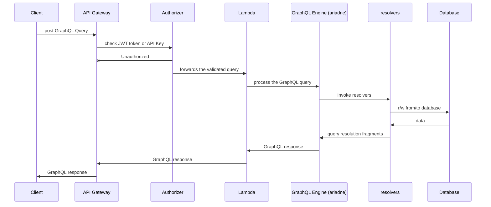
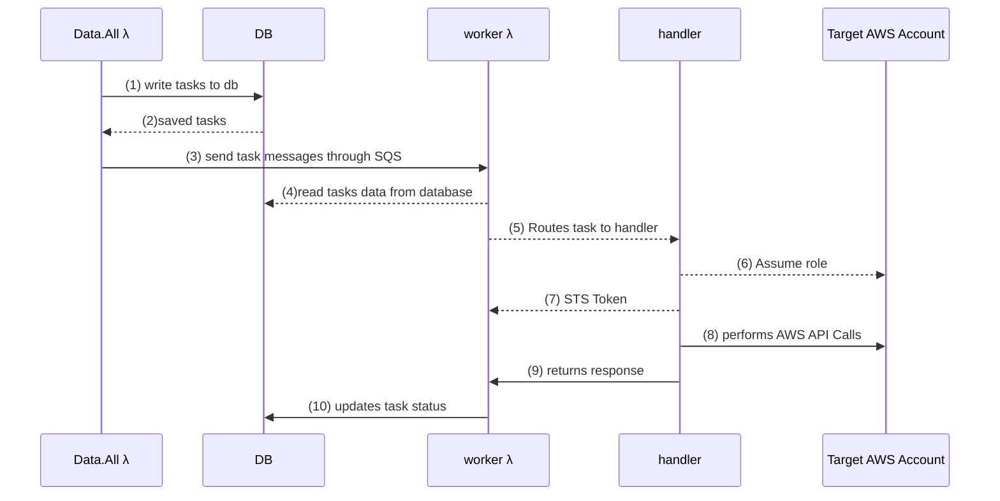

# Code Walkthrough

## Backend
The Data.All package is a mono-repo comprising of
several sub-packages, each used in one or many λ functions or in ECS container Tasks.


### `datahub`

#### `Data.All.api`

The Data.All `api` package is where the GraphQL API is defined.
Each GraphQL Type defined in the Data.All GraphQL API has one package in the `api.Objects` package,
and each defines the following modules

1. `schema.py` :  the definition of the schema
2. `mutations.py` : the definition of mutations for the GraphQL type
3. `queries.py` : the definition of queries for the GraphQL type
3. `input_types.py` : the definition on input types for the GraphQL type
4. `resolvers.py` : the actual code that *resolves* the fields


The `Data.All.gql` package is used to programmatically define GraphQL constructs.
Every resolver has the same signature:
```python
def resolve(context,source, **kwargs):
    pass

```

The parameters are defined as follows:

1. The `context` is provided by the GraphQL engine as an object with two properties
    - `context.engine` : a db.Engine instance (the database connection)
    - `context.username` : the username performing the api call
2. The `source` parameter is optional. If  provided, it holds the result of the parent field
3. `**kwargs` are the named field parameters


Adding fields, types to the API simply consists in defining the GraphQL type using `Data.All.gql`.
For example, this is how you would implement the following GraphQL specification:
```graphql
type Foo{
    fooId : ID!
    bar(upper:Boolean) : String
}
type Query{
    getFooById(fooId:String!)
}

```

- `Data.All.api.Objects.Foo.schema.py`

```python

from Data.All.api import gql
from Data.All.api.Objects.foo.resolvers import resolve_bar

Foo = gql.ObjectType(
    name="Foo",
    fields=[
        gql.Field(
            name="fooId",
            type=gql.NonNullableType(gql.ID)
        ),
        gql.Field(
            name="bar",
            type=gql.String,
            args=[
                gql.Argument(name="upper", type=gql.Boolean)
            ],
            resolver=resolve_bar
        )
    ]
)

```
- `Data.All.api.Objects.Foo.queries.py`

```python

from Data.All.api import gql
from Data.All.api.Objects.foo.resolvers import get_foo

getFoo = gql.Field(
    name="getFooById",
    type=gql.Ref("Foo"),
    resolver=get_foo
)

```

- `Data.All.api.Objects.Foo.resolvers.py`
```python
def resolve_bar(context, source,upper:bool=False):
    tmp = f"hello {context.username}"
    if upper:
        return tmp.upper()
    return tmp

def get_foo(context, source, fooId:str=None):
    return {"fooId" : fooId}

```


The api is exposed using the [`ariadne` GraphQL package](https://ariadnegraphql.org/).

The overall flow of GraphQL resolution is  found in the `app.py` module using
the [`graphqlsync`](https://ariadnegraphql.org/docs/0.4.0/api-reference#graphql_sync)  from `ariadne`.


#### `Data.All.cdkproxy`

This package contains the code associated with the ECS component.
The code in this package consists of wrapping the `cdk` cli through a REST API interface.
in this package, you'll find a package called `stacks` that holds the
definition  of AWS resources associated with Data.All high level abstractions (e.g. : Dataset).

The API itself consists of 4 actions/paths :

- GET / : is the server up ?
- POST /stack/{stackid} : create /update the stack
- DELETE /stack/{stackid} : deletes the stack
- GET /stack/{stackid] : returns stack status

The webserver is running on docker, using Python's  [FASTAPI](https://fastapi.tiangolo.com/) web framework and running using [uvicorn](https://www.uvicorn.org/) ASGI server.

When a Data.All resource is created, the api sends an HTTP request to the docker service and the code runs the appropriate stack using cdk the cli.

!!! note
    Why  not Lambda ?
    The `cdk` cli  offers no programmatic interface at the moment, and stacks can take
    long minutes to run. Also, spawning subprocess in lambda is doable but not idea.


**cdkproxy.stacks**

cdkproxy currently supports the following stacks defined as cdk stacks in the `cdkproxy.stacks` sub-package:

1. environment :  the environment stack bootstrap an AWS Account/ Region with resources and settings needed by Data.All to operate on the account
2. dataset: the dataset stack creates and updates all resources associated with the dataset, especially resources related to data sharing
3. gluepipeline : the glue pipeline stack creates a CI/CD pipeline for data processing
4. shareobject :  the share object stack is handling the import of remote shared tables in an environment using Lakeformation cross account data sharing


### `Data.All.aws`

The `Data.All.aws` package is where all the AWS logic is implemented.
The AWS Lambda hosting this code receives JSON objects sent by the api layer.
The JSON object received represents a task, and has three keys:

1. `action`: the name of the action to be performed
2. `taskid` : the identified of the task as found in the `task` table
3. `payload` : any additional information associated with the task

The `WorkerHandler` python class in `Data.All.aws.handlers.service_handlers` is in charge of
routing tasks to python functions.
This class has a singleton instance called `Worker` that has two apis:

1. `Worker.queue(engine, task_ids: [str]))` : an interface to send a list of task ids to the worker
2.  `Worker.process(engine, task_ids: [str])`: the actual work to process a list of tasks


Additionally, the `Worker` singleton exposes a decorator function to register handler functions.
For example, suppose you want to implement a handler for tasks with `{"action": "foo"}`.
The following code will register the `handle_foo` function as the handler for `foo` actions:
```python
from Data.All.aws import Worker
from Data.All import models

@Worker.handler(path="foo")
def handle_foo(engine, task: models.Task):
    pass

```

Any handler needs to have the same signature:
```python
from Data.All import models
def handler(engine, task:models.Task):
    """ handler signature """
    pass
```
Any handler will receive two parameters:

1. `engine` :  an instance of `db.Engine`
2. `task` : an instance of a `models.Task`  record


The code in `Data.All.api` will use the `Worker.queue` to queue tasks in the FIFO SQS queue **in order**.
The handler code in `Data.All.aws` will receive tasks, read task data from the Database,
and assume a role in the AWS Account Id where the action needs to be performed




### `Data.All.authorizer`

### `Data.All.db`

The `Data.All.db` package implements the database connection.
This all relies on the popular Python's `sqlalchemy` ORM package.
It can work with a local postgresql instance or with an Aurora database instance.
The exports from this package are

1. `aws.db.get_engine(envname='local')` : returns a wrapper for a SQLAlchemy  engine instance
2. `aws.db.Base` : a SQL alchemy Base metadata class
3. `aws.db.Resource` :  a SQL alchemy class that holds common fields (label, created,...) found in Data.All models
4. `aws.db.create_schema_and_tables` :  a method that will create schema and tables


### `Data.All.envman`

`envman` (aka environment manager) is a simple wrapper on top of
AWS **Parameter store**  and AWS **Secrets Manager**.
It is used to retrieve configurations for an environment, aka database host, account id, and more.
Environment variables are stored in Parameter Store when the application is deployed.
Each environment have the following pattern :
`Data.All.{env}/{path}`

The env parameter is associated with each lambda function as an enviroonment variable called
`envname`.

`envman.Parameter` is the main export from this package.
Other modules use the `Parameter` class to  retrieve parameters as follows:

```python
import os
from Data.All import envman
env=os.environ.get("envname","local")
host= envman.Parameter.get_parameter(env=env, path="db/host")
```

If parameter is not found, the method returns `None`.


### `Data.All.gql`

`gql` is a **code-first** graphql schema definition package.

It helps programmatically define GraphQL constructs (types, inputs, unions, enums, schema etc.)
and generate GraphQL schema string definition. It is different from a **schema-first** approach
where the schema is defined as a pure string,  which is error-prone and hard to maintain.


Other modules use `gql` to define GraphQL constructs and associate python code to the Fields to be resolved.
Most, if not all GraphQL grammar can be defined using `gql`:

```python

from Data.All.api import gql

# Defines a GraphQL object type
gql.ObjectType(
    name="MyType",
    fields=[
        # list of fields
        gql.Field(
            name="foo",
            type=gql.ID,
            args=[
                gql.Argument(name="param", type=gql.String)
            ],
            resolver=lambda *_, **__: "xxx"
        )
    ]
)

```

Each class defined in `gql` has a `gql` method returning the GraphQL representation of the object:

```python

from Data.All.api import gql

foo = gql.Field(name="foo", type=gql.String, args=[gql.Argument(name="bar", type=gql.String)])
print(foo.gql())
"""
will return :
foo(bar:String) : String
"""
```


- `gql` implement the following Scalar types:
    - `gql.ID` :
    - `gql.Integer` :
    - `gql.String`
    - `gql.Number`
    - `gql.Boolean`
    - `gql.Date`

- GraphQL Types are defined using the following classes:
    - `gql.ObjectType(name, fields)`: represents a GraphQL `type`
    - `gql.Field(name, fields, args, resolvers)` : represents a GraphQL `field`
    - `gql.Union(types)` : represents a GraphQL union type
    - `gql.Enum` : represents an GraphQL Enum
    - `gql.Schema(types, input_types, enums, unions)` : represents a Graphql `schema`
- GraphQL Arguments are defined using the following classes:
    - `gql.InputType(name, arguments)`: represents a GraphQL `input`
    - `gql.Argument (name,args)`
- GraphQL Type Modifiers are supported through type modifier classes:
    - `gql.NonNullableType(type)` : specifies the type is non nullable (e.g. `String!`)
    - `gql.ArrayType(type)` : represents an array of the provided type (e.g. `[String]`)
- Other exports from gql include:
    - `gql.Ref(name)` : a reference to a GraphQL construct, used as a work around to avoid circular references


### `Data.All.models`

The `models` package defines all tables defined in the  Data.All data model.
Classes defined as SQLAlchemy classes can inherit from :

- `Data.All.db.Base` :  a table with custom fields
- `Data.All.db.Resource` a table with fields inherited from the Resource class and additional custom fields


Models that inherit from `Resource` are used to map high level constructs like datasets, projects, environments, organizations.
Other models that inherits from `Base` are used to model internal data like many to many relations.


### `migrations`
### `docker`
### `blueprints`

## `frontend`

## `deploy`

We deploy the application backend using AWS Cloud Development Kit, which offers
high level abstractions to create AWS resources.

The deploy folder is actually a cdk application, with an `app.py` deploying the application stack.


!!! warning
    The application is under changes at the moment as we integrate a CI/CD pipeline to deploy
    the Data.All backend across different AWS Accounts.

 The stacks package contains one module for each AWS component :

```
deploy/stacks/
├── api.py
├── aurora.py : the API GW
├── cognito.py : the use rpool
├── container.py : the ECS
├── container_standalone.py : the standalone ECS stack
├── Data.All_standalone_stack.py : the webapp standalone stack
├── sqs.py: the sqs stack
├── lambdas.py : the lambda fx stack
├── pipeline.py : the Data.All ci/cd pipeline stack
├── pyNestedStack.py : a nested stack interface
└── vpc.py  : the VPC Stack
```

## `tests`

## `documentation`