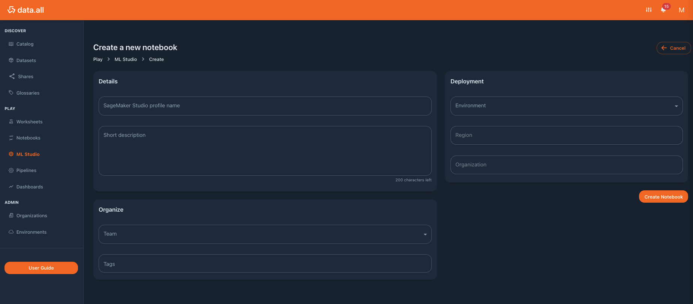
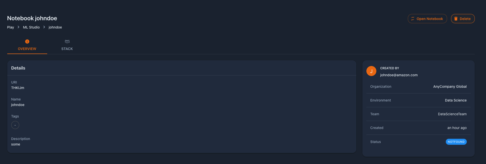

# **ML Studio**
With ML Studio Profiles we can add users to our SageMaker domain and open Amazon SageMaker Studio.
The SageMaker Studio domain is created as part of the environment stack. 

## 📦 **Create an ML Studio profile**
To create a new ML Studio profile, go to ML Studio on the left side pane and click on Create. Then fill in the creation form
with its corresponding information.

| Field                         | Description                                 | Required | Editable |Example
|-------------------------------|---------------------------------------------|----------|----------|-------------
| Sagemaker Studio profile name | Name of the user to add to SageMaker domain | Yes      | No       |johndoe
| Short description             | Short description about the user profile    | No       | No       |Notebook for Cannes exploration
| Tags                          | Tags                                        | No       | No       |deleteme
| Environment                   | Environment (and mapped AWS account)        | Yes      | No       |Data Science
| Region (auto-filled)          | AWS region                                  | Yes      | No       |Europe (Ireland)
| Organization (auto-filled)    | Organization of the environment             | Yes      | No       |AnyCompany EMEA
| Team                          | Team that owns the notebook                 | Yes      | No       |DataScienceTeam

## ☁️ **Check CloudFormation stack**
In the **Stack** tab of the ML Studio Profile, is where we check the AWS resources provisioned by data.all as well as its status.
As part of the CloudFormation stack deployed using CDK, data.all will deploy some CDK metadata and a SageMaker User Profile.

## 🗑️ **Delete an ML Studio user**

To delete a SageMaker user, simply select it and click on the **Delete** button in the top right corner. It is possible to
keep the CloudFormation stack associated with the User by selecting this option in the confirmation
delete window that appears after clicking on delete.

## 💻 **Open Amazon SageMaker Studio**
Click on the **Open ML Studio** button of the ML Studio notebook window to open Amazon SageMaker Studio.

